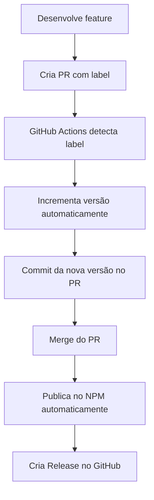

# 🚀 PR com Versionamento Automático

Este guia explica como criar PRs que automaticamente incrementam a versão e publicam no NPM quando merged.

## 🎯 Como Funciona

### **Fluxo Completo:**


## 🏷️ Labels Necessárias

Para que o versionamento automático funcione, você precisa adicionar uma dessas labels no PR:

- **`version:patch`** - Para correções (1.0.0 → 1.0.1)
- **`version:minor`** - Para novas funcionalidades (1.0.0 → 1.1.0)  
- **`version:major`** - Para mudanças grandes (1.0.0 → 2.0.0)

## 📋 Passo a Passo

### **1. Desenvolva sua feature**
```bash
git checkout -b feature/nova-funcionalidade
# ... desenvolva ...
git add .
git commit -m "feat: add new component"
git push origin feature/nova-funcionalidade
```

### **2. Crie o PR**
1. Vá para o GitHub
2. Crie um Pull Request
3. **IMPORTANTE**: Adicione uma das labels:
   - `version:patch` (para correções)
   - `version:minor` (para novas funcionalidades)
   - `version:major` (para mudanças grandes)

### **3. GitHub Actions executa automaticamente**
- Detecta a label
- Incrementa a versão no `package.json`
- Faz commit da nova versão no PR
- Comenta no PR com a nova versão

### **4. Merge o PR**
- Quando você fizer merge, a nova versão será automaticamente publicada no NPM
- Um Release será criado no GitHub
- O Storybook será atualizado

## 🔍 Exemplo Prático

### **Situação**: Versão atual 1.0.5

### **Cenário 1 - Correção de Bug:**
```bash
# 1. Desenvolva a correção
git checkout -b fix/button-bug
# ... corrige o bug ...
git commit -m "fix: button component styling issue"
git push origin fix/button-bug

# 2. Crie PR com label "version:patch"
# 3. GitHub Actions incrementa para 1.0.6
# 4. Merge → Publica 1.0.6 no NPM
```

### **Cenário 2 - Nova Funcionalidade:**
```bash
# 1. Desenvolva a nova funcionalidade
git checkout -b feature/new-card
# ... adiciona novo componente Card ...
git commit -m "feat: add Card component"
git push origin feature/new-card

# 2. Crie PR com label "version:minor"
# 3. GitHub Actions incrementa para 1.1.0
# 4. Merge → Publica 1.1.0 no NPM
```

## 🏷️ Como Adicionar Labels

### **Método 1: Interface do GitHub**
1. Vá para o PR
2. Clique em **Labels** (lado direito)
3. Selecione uma das labels:
   - `version:patch`
   - `version:minor`
   - `version:major`

### **Método 2: Comando Git**
```bash
# Adicionar label via GitHub CLI (se tiver instalado)
gh pr edit [PR_NUMBER] --add-label "version:patch"
```

## 🔄 Fluxo de Trabalho Recomendado

### **Para Correções:**
1. Desenvolva a correção
2. Crie PR com label `version:patch`
3. Merge → Versão patch publicada

### **Para Novas Funcionalidades:**
1. Desenvolva a funcionalidade
2. Crie PR com label `version:minor`
3. Merge → Versão minor publicada

### **Para Mudanças Grandes:**
1. Desenvolva a mudança
2. Crie PR com label `version:major`
3. Merge → Versão major publicada

## ⚠️ Importante

### **Labels são Obrigatórias**
- Sem label, o PR não incrementa versão
- Apenas faz build e testes normais

### **Versão é Incrementada no PR**
- A versão é incrementada **antes** do merge
- Você pode ver a nova versão no PR
- O commit de versionamento aparece no PR

### **Publicação Acontece no Merge**
- A nova versão só é publicada no NPM quando o PR é merged
- Um Release é criado automaticamente no GitHub

## 🚨 Troubleshooting

### **PR não incrementa versão**
- Verifique se a label está correta
- Confirme se a label está no PR
- Veja os logs do GitHub Actions

### **Versão não é publicada**
- Verifique se o PR foi merged
- Confirme se o `NPM_TOKEN` está configurado
- Veja os logs do workflow `publish-on-merge`

### **Label não aparece**
- Crie a label no repositório primeiro
- Vá para **Issues** > **Labels** > **New label`
- Crie as labels: `version:patch`, `version:minor`, `version:major`

## 📊 Benefícios

- ✅ **Versionamento automático** - Não precisa lembrar de incrementar versão
- ✅ **Publicação automática** - NPM é atualizado automaticamente
- ✅ **Release automático** - GitHub Release é criado automaticamente
- ✅ **Controle de versão** - Você escolhe o tipo de versão via label
- ✅ **Transparência** - Nova versão é visível no PR antes do merge

## 🎯 Resumo

1. **Desenvolva** sua feature
2. **Crie PR** com label `version:patch/minor/major`
3. **GitHub Actions** incrementa versão automaticamente
4. **Merge** → Nova versão publicada no NPM
5. **Release** criado automaticamente no GitHub

Agora você pode desenvolver e publicar novas versões de forma totalmente automatizada! 🚀
